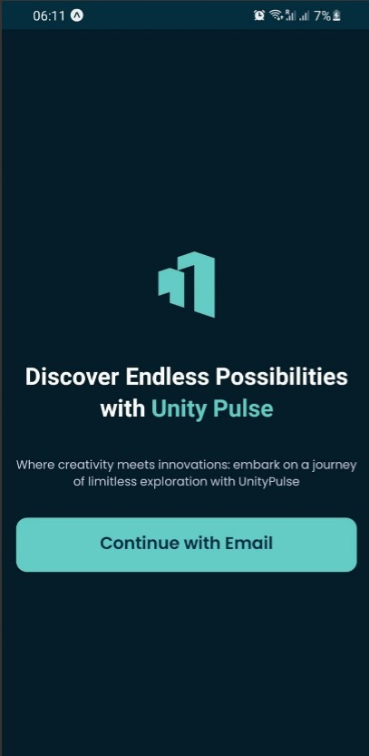
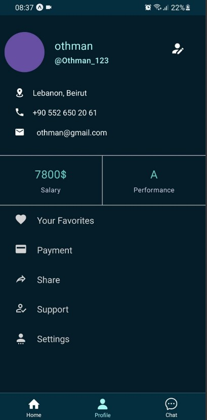

<br><br>

<!-- project philosophy -->


> A comprehensive company management platform, empowering businesses to streamline operations and enhance efficiency, ensuring seamless collaboration and productivity across all departments.
>
> UNITY PULSE aims to revolutionize business operations by providing a centralized platform for comprehensive management across all aspects of the organization. We aim to simplify tasks such as employee management, finance tracking, task delegation, and communication, ultimately enhancing efficiency and productivity within businesses.

### User Stories:

#### Business Owner:

- As a business owner, I should be able to define and update company policies such as code of conduct, HR policies, etc., ensuring all employees are aware and compliant.

- As a business owner, I need to schedule and manage team meetings, including sending invites, setting agendas, and tracking attendance, to facilitate effective communication and collaboration.

- As a business owner, I need to manage project budgets, track expenses, and approve expenses submitted by team members, ensuring projects stay within budget constraints.

#### Employee:

- As an employee, I value having a centralized directory that provides detailed profiles of my colleagues, including their contact information and job roles, allowing for seamless collaboration and efficient communication.

- As an employee, I need to provide feedback on projects, processes, or team dynamics through anonymous surveys or suggestion boxes, fostering a culture of continuous improvement and employee engagement.

- As an employee, I have to be able to request flexible work arrangements such as remote work, flexible hours, or job sharing, supported by the company's policies and systems for managing work arrangements.

<br><br>

<!-- Tech stack -->


### Unity Pulse is built using the following technologies:

- This project uses the [React](https://react.dev/) library for building the user interface. React is a powerful JavaScript library for building dynamic and responsive web applications.

- The backend of the application is powered by [Express](https://expressjs.com/), a fast and minimalist web framework for Node.js, which allows for robust routing and middleware capabilities.

- For persistent storage (database), the application uses [MongoDB](https://www.mongodb.com/), a NoSQL database that provides flexible and scalable data management.

- The mobile app is developed using [React Native](https://reactnative.dev/), a framework that allows for the development of cross-platform mobile applications using a single codebase.

- For styling, the application utilizes [Tailwind CSS](https://tailwindcss.com/), a utility-first CSS framework that enables rapid and efficient UI development.

- To enable real-time communication and live chatting, the application incorporates [Socket.IO](https://socket.io/), a library that enables low-latency, bidirectional, and event-based communication between the browser and server.

<br><br>

<!-- UI UX -->


> We designed Unity Pulse using wireframes and mockups, iterating on the design until we reached the ideal layout for easy navigation and a seamless user experience.

### Mockups

| Home screen                             | Menu Screen                           | Order Screen                          |
| --------------------------------------- | ------------------------------------- | ------------------------------------- |
|  |  |  |

<br><br>

<!-- Database Design -->


### Architecting Data Excellence: Innovative Database Design Strategies:


<br><br>

<!-- Implementation -->


### Business Owners Screens (Web)

| Login screen                                  | Signup screen                             | Hero screen                                 |
| --------------------------------------------- | ----------------------------------------- | ------------------------------------------- |
|        |     |  |
| Landing Screen                                | Customers Screen                          | Manage Screen                               |
|  |  |       |

| Employees screen                                   | Calendar screen                              | Editor Screen                               |
| -------------------------------------------------- | -------------------------------------------- | ------------------------------------------- |
|         |      |       |
| Dashboard Screen                                   | Transactions Screen                          | Company Info Screen                         |
|  |  |  |

| Chat screen                                  | Chatbot Screen                              |
| -------------------------------------------- | ------------------------------------------- |
|  |  |

### Employee Screens (Mobile)

| OnBoarding Screen                              | Login Screen                                  | Home Screen                                  |
| ---------------------------------------------- | --------------------------------------------- | -------------------------------------------- |
|  |  |  |

| Profile Screen                            | Users Screen                                    | Chat Screen                                    |
| ----------------------------------------- | ----------------------------------------------- | ---------------------------------------------- |
|  |  |  |

<br><br>

<!-- Prompt Engineering -->


### Mastering AI Interaction: Unveiling the Power of Prompt Engineering:

- This project harnesses advanced prompt engineering techniques to optimize AI interactions. Utilizing OpenAI's ChatGPT-3.5 model, we swiftly generate examples based on user-created labels, expediting ML model creation. Seamlessly integrating human-AI collaboration, our approach empowers businesses with real-time, insightful assistance, revolutionizing operations.

<br><br>

<!-- AWS Deployment -->


### Efficient AI Deployment: Unleashing the Potential with AWS Integration:

This project utilizes AWS deployment. Next, we'll go through the steps of launching a Node.js Express server on AWS EC2:

The initial step involves creating an AWS account and accessing the AWS Management Console, where you can proceed to set up your virtual server instance using the EC2 service.

Establish a connection to the EC2 instance using PuTTY:

1. **Convert .pem to .ppk Using PuTTYgen:**

   - Use PuTTYgen to convert your .pem key file to a .ppk key file.

2. **Connect Using PuTTY:**

   - Launch PuTTY and enter the public IPv4 address of your EC2 instance.
   - In the credentials section, specify the .ppk key file you generated in the previous step.

3. **Update and Upgrade Packages:**

   - Run the following commands to update and upgrade packages on your EC2 instance:

     ```
     sudo apt update
     sudo apt upgrade
     ```

4. **Install Node.js and NPM:**

   - Use the following command to install Node.js and NPM:
     ```
     sudo apt-get install -y nodejs npm
     ```

5. **Install git and Clone the Repository:**

   - Use the following commands to install git and clone the repository:
     ```
     sudo apt-get install git
     git clone https://github.com/OthmanGh/UNITY-PULSE.git
     cd UNITY-PULSE/backend/
     ```

6. **Create .env File:**

   - Use the following command to create and edit a new .env file:
     ```
     nano .env
     ```
   - Inside the .env file, add your environment variables as shown below:
     ```
     # Add your environment variables:
     MONGODB_URI=your_uri
     PORT=your_port
     JWT_SECRET=your-secret
     OPENAI_API_KEY=your_key
     ```

7. **Install Dependencies:**

   - Run the following command to install the dependencies for your Node.js application:

     ```
     npm install
     ```

8. **Start the Server:**

   - To launch your Node.js Express server, use the following command:
     ```
     npm start
     ```

9. **Fetching From Server:**
   - Below is an example of fetching from the server:
     

<br><br>

<!-- Unit Testing -->


### Precision in Development: Harnessing the Power of Unit Testing:

- This project employs rigorous unit testing methodologies to ensure the reliability and accuracy of code components. By systematically evaluating individual units of the software, we guarantee a robust foundation, identifying and addressing potential issues early in the development process.

<br><br>

<!-- How to run -->


> To set up Coffee Express locally, follow these steps:

### Prerequisites

This is an example of how to list things you need to use the software and how to install them.

- npm
  ```sh
  npm install npm@latest -g
  ```

### Installation

_Below is an example of how you can instruct your audience on installing and setting up your app. This template doesn't rely on any external dependencies or services._

1. Get a free API Key at [example](https://example.com)
2. Clone the repo
   git clone [github](https://github.com/your_username_/Project-Name.git)
3. Install NPM packages
   ```sh
   npm install
   ```
4. Enter your API in `config.js`
   ```js
   const API_KEY = 'ENTER YOUR API';
   ```

Now, you should be able to run Coffee Express locally and explore its features.
