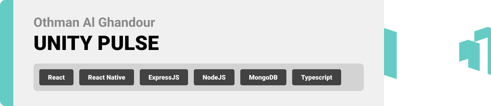
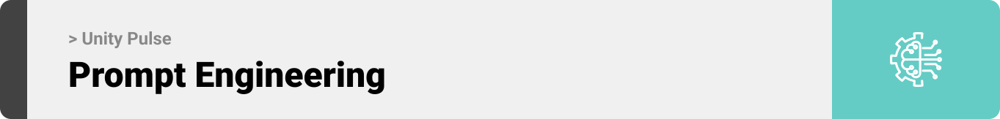

<br><br>

<!-- project philosophy -->


> A comprehensive company management platform, empowering businesses to streamline operations and enhance efficiency, ensuring seamless collaboration and productivity across all departments.
>
> UNITEY PULSE aims to revolutionize business operations by providing a centralized platform for comprehensive management across all aspects of the organization. We aim to simplify tasks such as employee management, finance tracking, task delegation, and communication, ultimately enhancing efficiency and productivity within businesses.

### User Stories:

#### Business Owner:

- As a business owner, I should be able to track attendance, manage leaves, and evaluate employee performance within the system.

- As a business owner, I should be able to define and update company policies such as code of conduct, HR policies, etc., ensuring all employees are aware and compliant.

- As a business owner, I should define clear goals and objectives for individual employees or teams.

#### Project Manager:

- As a project manager, I need to schedule and manage team meetings, including sending invites, setting agendas, and tracking attendance, to facilitate effective communication and collaboration.

- As a project manager, I need to manage project budgets, track expenses, and approve expenses submitted by team members, ensuring projects stay within budget constraints.

- As a project manager, I need to allocate resources efficiently across projects, ensuring that tasks are appropriately assigned based on team members' skills and availability to optimize productivity.

#### Employee:

- As an employee, I value having a centralized directory that provides detailed profiles of my colleagues, including their contact information and job roles, allowing for seamless collaboration and efficient communication.

- As an employee, I need to provide feedback on projects, processes, or team dynamics through anonymous surveys or suggestion boxes, fostering a culture of continuous improvement and employee engagement.

- As an employee, I have to be able to request flexible work arrangements such as remote work, flexible hours, or job sharing, supported by the company's policies and systems for managing work arrangements.

  <br><br>

<!-- Tech stack -->


### Coffee Express is built using the following technologies:

- This project uses the [Flutter app development framework](https://flutter.dev/). Flutter is a cross-platform hybrid app development platform which allows us to use a single codebase for apps on mobile, desktop, and the web.
- For persistent storage (database), the app uses the [Hive](https://hivedb.dev/) package which allows the app to create a custom storage schema and save it to a local database.
- To send local push notifications, the app uses the [flutter_local_notifications](https://pub.dev/packages/flutter_local_notifications) package which supports Android, iOS, and macOS.
  - 🚨 Currently, notifications aren't working on macOS. This is a known issue that we are working to resolve!
- The app uses the font ["Work Sans"](https://fonts.google.com/specimen/Work+Sans) as its main font, and the design of the app adheres to the material design guidelines.

<br><br>

<!-- UI UX -->


> We designed Coffee Express using wireframes and mockups, iterating on the design until we reached the ideal layout for easy navigation and a seamless user experience.

- Project Figma design [figma](https://www.figma.com/file/LsuOx5Wnh5YTGSEtrgvz4l/Purrfect-Pals?type=design&node-id=257%3A79&mode=design&t=adzbABt5hbb91ucZ-1)

### Mockups

| Home screen                             | Menu Screen                           | Order Screen                          |
| --------------------------------------- | ------------------------------------- | ------------------------------------- |
|  |  |  |

<br><br>

<!-- Database Design -->


### Architecting Data Excellence: Innovative Database Design Strategies:

- Insert ER Diagram here

<br><br>

<!-- Implementation -->


### User Screens (Mobile)

| Login screen                              | Register screen                         | Landing screen                          | Loading screen                          |
| ----------------------------------------- | --------------------------------------- | --------------------------------------- | --------------------------------------- |
|  |  |  |  |
| Home screen                               | Menu Screen                             | Order Screen                            | Checkout Screen                         |
|  |  |  |  |

### Admin Screens (Web)

| Login screen                            | Register screen                       | Landing screen                        |
| --------------------------------------- | ------------------------------------- | ------------------------------------- |
|  |  |  |
| Home screen                             | Menu Screen                           | Order Screen                          |
|  |  |  |

<br><br>

<!-- Prompt Engineering -->


### Mastering AI Interaction: Unveiling the Power of Prompt Engineering:

- This project uses advanced prompt engineering techniques to optimize the interaction with natural language processing models. By skillfully crafting input instructions, we tailor the behavior of the models to achieve precise and efficient language understanding and generation for various tasks and preferences.

<br><br>

<!-- AWS Deployment -->


### Efficient AI Deployment: Unleashing the Potential with AWS Integration:

- This project leverages AWS deployment strategies to seamlessly integrate and deploy natural language processing models. With a focus on scalability, reliability, and performance, we ensure that AI applications powered by these models deliver robust and responsive solutions for diverse use cases.

<br><br>

<!-- Unit Testing -->


### Precision in Development: Harnessing the Power of Unit Testing:

- This project employs rigorous unit testing methodologies to ensure the reliability and accuracy of code components. By systematically evaluating individual units of the software, we guarantee a robust foundation, identifying and addressing potential issues early in the development process.

<br><br>

<!-- How to run -->


> To set up Coffee Express locally, follow these steps:

### Prerequisites

This is an example of how to list things you need to use the software and how to install them.

- npm
  ```sh
  npm install npm@latest -g
  ```

### Installation

_Below is an example of how you can instruct your audience on installing and setting up your app. This template doesn't rely on any external dependencies or services._

1. Get a free API Key at [example](https://example.com)
2. Clone the repo
   git clone [github](https://github.com/your_username_/Project-Name.git)
3. Install NPM packages
   ```sh
   npm install
   ```
4. Enter your API in `config.js`
   ```js
   const API_KEY = 'ENTER YOUR API';
   ```

Now, you should be able to run Coffee Express locally and explore its features.
